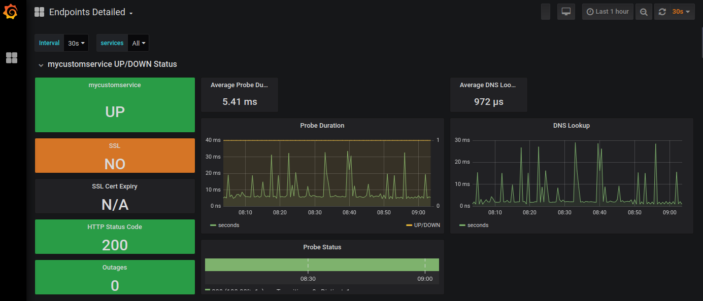

# Monitoring customisation

It's possible to add your own monitoring and alerting to the cluster after it's installed.

## Prerequisties

* we'll need Integre8ly 1.5.x installed on the cluster
* `oc` commands require user to be logged in already as a cluster admin

If there is any service that needs to be added for the monitoring, this service usually runs in its own namespace. Any such namespace needs to have  `monitoring-key=middleware` label set to allow monitoring of the service. There is the namespace `my-customservice` in the following examples.

To add such label, you can use `oc` command:

```bash
oc label namespace my-customservice "monitoring-key=middleware"
```

There are 3 different examples for adding monitoring on the middleware service. 

* HTTP(s) endpoint monitoring - simply alert if service is not returning proper HTTP status code

* Kubernetes monitoring - use various stats provided by [https://github.com/kubernetes/kube-state-metrics](kube-state-metrics), such as count of pods in Ready state

* CPU/Memory per pod limits monitoring - check if CPU utilisation or used memory doesn't go above certain threshold


### HTTP(s) endpoint monitoring

Your service usually has a HTTP/HTTPs endpoint and we want to monitor if it returns HTTP 2xx status code. The easiest way to monitor that is by addding your rule using *BlackboxTarget*. The Blackbox Target CR accepts the following properties in the spec:

* *blackboxTargets*: A list of targets for the blackbox exporter to probe.

The `blackboxTargets` should be provided as an array in the form of:

```yaml
  blackboxTargets:
    - service: example
      url: https://example.com
      module: http_extern_2xx
```

where `service` will be added as a label to the metric, `url` is the URL of the route to probe and `module` can be one of:

* *http_2xx*: Probe http or https targets via GET using the cluster certificates
* *http_post_2xx*: Probe http or https targets via POST using the cluster certificates
* *http_extern_2xx*: Probe http or https targets via GET relying on a valid external certificate

Follow up on the example here - https://github.com/integr8ly/application-monitoring-operator/blob/master/deploy/examples/BlackboxTarget.yaml

The process of adding your own alert is this:

1) Create yaml file locally with the `BlackboxTarget` CR (by modifying `BlackboxTarget.yaml` example above):

```yaml
apiVersion: applicationmonitoring.integreatly.org/v1alpha1
kind: BlackboxTarget
metadata:
  name: custom-mycustomservice-blackboxtarget
spec:
  blackboxTargets:
    - service: mycustomservice
      url: http://mycustomservice-my-nodejsproject.apps.vsazel-a4c3.open.redhat.com/  #this is an URL of the service you want to monitor, replace it with yours
      module: http_extern_2xx
```

and import CR to your cluster:

```bash
$ oc create -f BlackboxTarget.yaml -n middleware-monitoring
blackboxtarget.applicationmonitoring.integreatly.org/example-blackboxtarget created
```

2) Create yaml file `CustomMonitoringRule.yaml` locally with the alerting CR `PrometheusRule`. 

```yaml
apiVersion: monitoring.coreos.com/v1
kind: PrometheusRule
metadata: 
  labels:
    monitoring-key: custom-monitoring
    prometheus: application-monitoring
    role: alert-rules
  name: custom-alerts
spec:   
  groups: 
    - name: mycustomservice.rules
      rules: 
      - alert: ExampleCustomServiceUnavailableAlert
        annotations:
          message: >-
            Custom Service unavailable: If this console is
            unavailable, the clients won't be able to do something.
        expr: >
          probe_success{job="blackbox",service="mycustomservice"} < 1 or
            absent(probe_success{job="blackbox",service="mycustomservice"})
        for: 5m
        labels:
          severity: critical
```
and import it same as in previous case

```bash
$ oc create -f CustomMonitoringRule.yaml -n middleware-monitoring
prometheusrule.monitoring.coreos.com/custom-alerts created
```

3) In *Prometheus* UI you should see the new alert. Check if it's working by killing the monitored service (decreasing pod count to 0).

.


### Kubernetes monitoring

Other way to monitor your custom services is to use Kubernetes monitoring itself. Integr8ly itself contains *kube-state-metrics* statistics.

Check out the documentation on that there - https://github.com/kubernetes/kube-state-metrics/tree/master/docs

1) Create yaml file `CustomMonitoringKubernetesRules.yaml` and in there custom `PrometheusRule` CR:

_Note: (Example Node.js project has `mycustomservice` container and is running in namespace `my-nodejsproject`) _

```yaml
apiVersion: monitoring.coreos.com/v1
kind: PrometheusRule
metadata: 
  labels:
    monitoring-key: middleware
    prometheus: application-monitoring
    role: alert-rules
  name: custom-kubernetes-alerts
spec:   
  groups: 
    - name: mycustomservice.rules
      rules: 
      - alert: ExampleCustomServicePodsAlert
        annotations:
          message: >-
            Custom Service pod: No pods ready.
        expr: > #replace in the following expression namespace, and label_deploymentconfig to fit your service
          (1-absent(kube_pod_labels{namespace="my-nodejsproject",label_deploymentconfig="mycustomservice"} * 
          on(pod,pod) kube_pod_status_ready{namespace="my-nodejsproject", condition="true"})) 
        for: 5m
        labels:
          severity: critical
```

2) Save it and import

```bash
$ oc create -f CustomMonitoringKubernetesRules.yaml -n middleware-monitoring
prometheusrule.monitoring.coreos.com/custom-kubernetes-alerts created
```

3) Check it in *Prometheus* UI

### CPU and memory monitoring

Another useful metric is usually to check CPU and memory utilisation and how it goes with set up pod limits on Kubernetes cluster. This requires CPU and memory limits for the pod to be set in the deployment config.

_Note: Some service is running in `my-customservice` container_

1) Create yaml file `CustomMonitoringLimitsRules.yaml` and in there custom `PrometheusRule` CR: 

```yaml
apiVersion: monitoring.coreos.com/v1
kind: PrometheusRule
metadata: 
  labels:
    monitoring-key: middleware
    prometheus: application-monitoring
    role: alert-rules
  name: custom-limits-alerts
spec:   
  groups: 
    - name: mycustomservice.rules
      rules: 
      - alert: MyServicePodCPUHigh
        expr: > #replace in the following expression namespace to fit your service
          "(sum(label_replace(sum by(namespace, pod_name, container_name) (rate(container_cpu_usage_seconds_total{namespace='my-customservice'}[5m])), 'container', '$1', 'container_name', '(.*)')) by (container) / sum(kube_pod_container_resource_limits_cpu_cores{namespace='my-customservice'}) by (container) * 100) > 90"
        for: 5m
        labels:
          severity: warning
        annotations:
          description: "The MyService pod has been at 90% CPU usage for more than 5 minutes."
          summary: "The MyService is reporting high cpu usage for more that 5 minutes."        
      - alert: MyServicePodMemoryHigh
        expr: > #replace in the following expression namespace to fit your service
          "(sum by(container) (label_replace(container_memory_usage_bytes{container_name!='',namespace='my-customservice'}, 'container', '$1', 'container_name', '(.*)')) / sum by(container) (kube_pod_container_resource_limits_memory_bytes{namespace='my-customservice'}) * 100) > 90"
        for: 5m
        labels:
          severity: warning
        annotations:
          description: "The MyService pod has been at 90% memory usage for more than 5 minutes."
          summary: "The MyService is reporting high memory usage for more that 5 minutes."
```

2) Save it and import

```bash
$ oc create -f CustomMonitoringLimitsRules.yaml -n middleware-monitoring
prometheusrule.monitoring.coreos.com/custom-limits-alerts created
```

3) Check it in *Prometheus* UI


## Items created in the built-in Grafana dashboards

If you add `BlackboxTarget` it makes service automatically visible on the *Endpoints Summary*, *Endpoints Report* and *Endpoints Detailed* dashboards.




